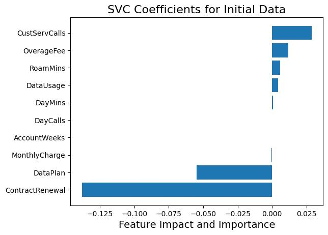
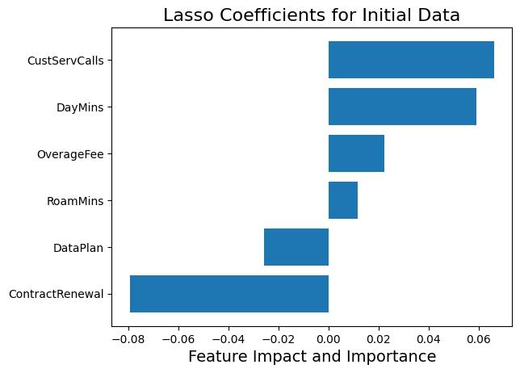
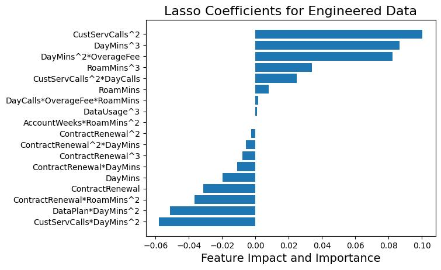
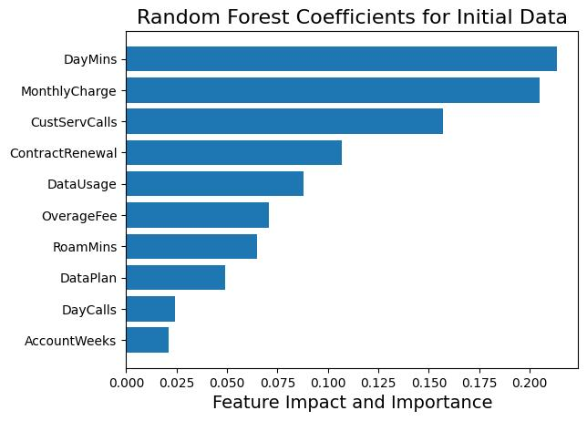
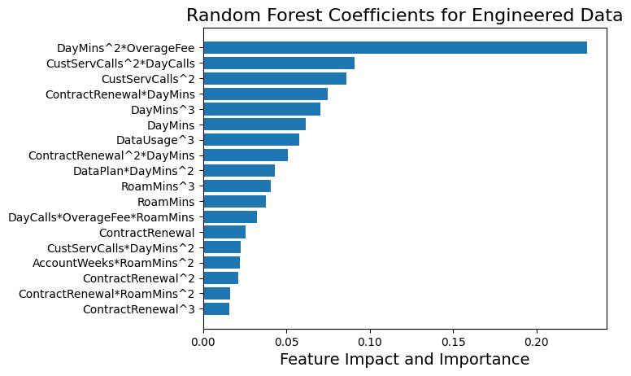
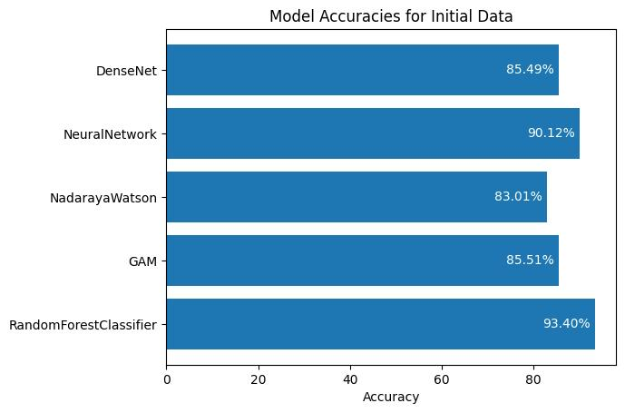
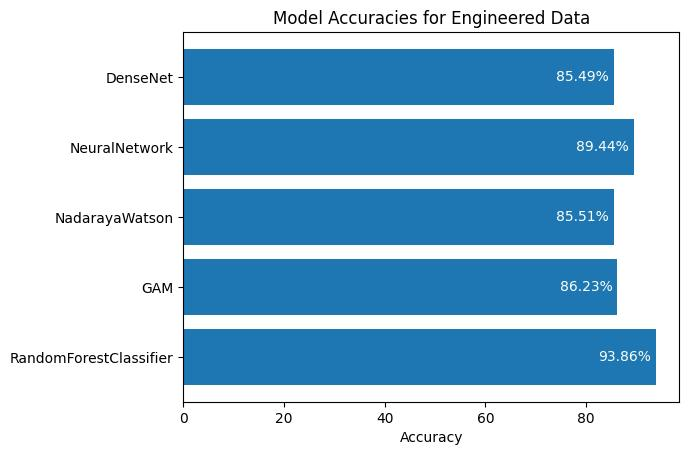
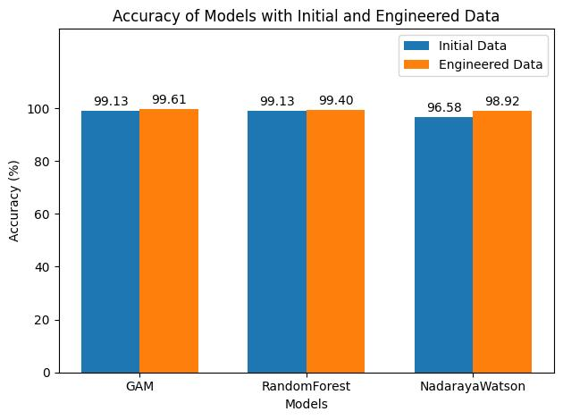

# Leveraging Machine Learning Techniques to Forecast Customer Churn: A Comparative Study
#### Matthew Cheng
## Introduction
In today's highly competitive business landscape, customer churn poses a significant challenge for companies across various industries, including the telecommunications sector. Customer churn refers to the termination of a customer’s subscription or ceased engagement with a particular product or service. Understanding and effectively predicting customer churn is crucial for companies seeking to enhance customer retention, reduce revenue loss, and optimize their business strategies.
The ability to accurately model customer churn, like other business benchmarks, has become increasingly important in recent years due to the rise in data availability and the advancements in machine learning techniques (Huang et al., 2012). By leveraging these techniques, companies can proactively identify customers who are at a higher risk of churning and implement targeted retention strategies to mitigate this risk. Moreover, exploring the importance of different features in predicting churn can offer valuable insights into the factors influencing customer decisions, empowering businesses to make data-driven improvements to their offerings and services.
Furthermore, investing in customer retention is often more cost-effective than acquiring new customers (Kim et al, 2020). Studies have shown that the cost of acquiring new customers can be significantly higher than retaining existing ones, potentially exceeding their cost by several times (S. Kumar, 2022). By reducing churn and increasing customer loyalty, companies can maximize the lifetime value of their customer base, leading to long-term profitability and sustainable growth (Mustafa et al., 2021).
Therefore, the primary objective of this research project is to develop and compare different machine learning models to predict customer churn in the context of a telecommunications company. We aim to evaluate the performance of four distinct models: Generalized Additive Modeling, Nadaraya-Watson Estimation, Random Forest Regression, Neural Network, and DenseNet. By employing these models, we seek to achieve high validation accuracies and identify the most effective approach for accurate churn prediction.
Additionally, we aim to investigate the feature importance within the selected models. Understanding which features have the most significant impact on churn prediction can provide actionable insights for companies to prioritize their resources and efforts. By uncovering the key factors driving customer churn, businesses can implement targeted strategies to address these factors and improve overall customer retention rates. To see the importance of features from the dataset, we will be employing a LinearSVC. In addition, some models have built in attributes, such as feature_importances_ from RandomForestRegressor, that display the specific importance for that model. We will be investigating these attributes as well.
By combining accurate churn prediction with a comprehensive analysis of feature importance, this research aims to contribute to the field of customer retention and empower businesses with valuable insights for proactive churn management and strategic decision-making.
In the subsequent sections of this paper, we will discuss the dataset used, the methodology employed, the results obtained, and the implications of our findings.

## Data
The dataset used in this research project was found on Kaggle and obtained from an anonymous telecommunications company (K. Kumar, 2020). It consists of 3333 observations and 11 features, including the target feature, Churn. The dataset provides valuable information on customer attributes and behavior, allowing us to investigate and model customer churn.
The dataset includes the following features:
*	Churn: Binary variable indicating whether the customer canceled their subscription (1) or not (0).
*	AccountWeeks: The number of weeks that the customer's account has been active.
*	ContractRenewal: Binary variable indicating whether the customer recently renewed their contract (1) or not (0).
*	DataPlan: Categorical variable indicating whether a customer has a data plan (1) or not (0).
*	DataUsage: The average monthly data used by the customer in gigabytes.
*	CustomerServiceCalls: The total number of calls made to customer service by the customer.
*	DayMins: The average monthly daytime minutes the customer spends on calls.
*	DayCalls: The average monthly daytime calls made by the customer.
*	MonthlyCharge: The average monthly charge for the customer.
*	OverageFee: The largest fee incurred by the customer due to exceeding the data usage limit within the past year.
*	RoamMins: The average monthly minutes the customer spent on roaming calls.
Before conducting the analysis, the dataset underwent scaling by a standard scaler, to ensure uniformity across the variables. The categorical variables had already been one-hot encoded by the provider of the data. 
During the Exploratory Data Analysis phase, several insights were derived from the dataset. It was observed that the churn rate within the telecommunications company was approximately 14.5%, a rate lower than many other companies worldwide (Mustafa et al., 2021). The various features also followed different distributions. AccountWeeks, DayMins, DayCalls, OverageFee, and RoamingMins were all approximately normally distributed. CustServCalls and MonthlyCharge were both skewed to the right; behavior that was not unexpected. Most of the customers, 90.3%, had recently renewed their contract, whereas only 27.7% of customers had a data plan. Following this pattern, the majority of customers had a DataUsage of 0, however the customers that did have a data plan saw their DataUsage approximately normally distributed. Correlation analysis revealed some anticipated relationships, such as a positive correlation between data usage and monthly charges, as well as some interesting relationships, like a negative correlation between account age and churn.
It is important to acknowledge the limitations of the dataset. Since this dataset was found in a pre-cleaned state, it is unclear as to whether there may be potential bias in the data due to incomplete or omitted observations. Additionally, some of the features are not entirely clear as to what they represent, such as ContractRenewal, as the definition of “recently”, in context, is not explicitly stated. The dataset also originates from a single telecommunications company, the findings and model performance may not be universally applicable to other industries or contexts (Zhang et al., 2022).
## Methods
### Pre-processing
To prepare the dataset for modeling, several pre-processing steps were performed, including feature generation, scaling, and feature engineering. First, the dataset underwent feature generation using PolynomialFeatures from the SciKit-Learn library, the source for many of the models and methods used in this project. This approach created polynomial combinations up to the third degree from the original features, capturing potential non-linear relationships and complex patterns in the data.
Next, the dataset was standardized using the StandardScaler from SciKit-Learn. Standard scaling ensures that all features are on a similar scale by transforming the data to have zero mean and unit variance. This step is crucial to prevent features with larger magnitudes from dominating the learning process.
Feature engineering involved the exploration of regularization techniques, including Lasso, Ridge, and ElasticNet, to identify the most relevant features for predicting customer churn. These regularization methods impose constraints on the model coefficients, promoting sparsity and mitigating overfitting.
Models were trained using Lasso, Ridge, and ElasticNet with varying alpha values to determine the most suitable regularization technique. The resulting mean squared errors (MSE) were compared to assess prediction performance. It was found that Lasso with an alpha value of 0.01 consistently yielded the best preliminary results, providing low prediction errors and a reduced feature set.
The decision to use Lasso over Ridge and ElasticNet was driven by its ability to remove a greater number of less informative features, without hindering model performance, resulting in a concise and interpretable feature set. Using Lasso, a final selection of 18 features was identified, including factors such as contract renewal, call duration, roaming minutes, data plan, customer service calls, account weeks, overage fees, and data usage. These features offer valuable insights into the factors significantly impacting customer churn.
### Analytical
In this research project, we selected a range of models based on their distinct characteristics and their suitability for addressing the problem of customer churn prediction. The chosen models include Generalized Additive Modeling (GAM), Nadaraya-Watson estimator, Neural Network, DenseNet, and RandomForestClassifier, each offering unique advantages in capturing different patterns and relationships within the data.
Generalized Additive Modeling (GAM): GAM is a flexible and interpretable model that extends the concept of linear regression to capture non-linear relationships between predictors and the target variable (Hastie et al., 1987). It allows for smooth functions of each predictor variable using spline basis functions. GAM estimates the relationship between each predictor and the target variable, while considering the effects of other predictors. The smoothness of the functions is controlled by the model's degrees of freedom, enabling the model to adaptively capture complex non-linear patterns.
Nadaraya-Watson estimator: Nadaraya-Watson estimator, also known as Kernel Regression, is a non-parametric regression technique (Bierens, 1988). It estimates the target variable by assigning weights to neighboring data points based on their distances. The weights are determined by a kernel function, such as the polynomial kernel, which gives higher weights to closer data points. The Nadaraya-Watson estimator is particularly useful when the relationship between predictors and the target variable is non-linear or when the functional form of the relationship is unknown. It provides flexibility and can capture complex patterns without making strong assumptions about the underlying relationship.
Neural Network: Neural networks are a class of models inspired by the structure and functioning of the human brain. They consist of multiple layers of interconnected nodes called neurons. Each neuron applies a non-linear activation function to a linear combination of its inputs. Neural networks can learn complex patterns and relationships in the data by adjusting the weights and biases of the neurons during the training process (Bishop, 1994). They excel at capturing non-linear interactions and can model intricate relationships between predictors and the target variable. The architecture of a neural network, including the number of layers and the number of neurons in each layer, can be customized based on the complexity of the problem at hand.
DenseNet: DenseNet is a specific type of neural network architecture that emphasizes dense connectivity between layers (Zhu et al., 2017). In DenseNet, each layer is connected to every other layer in a feed-forward manner. This dense connectivity allows information to flow more freely across layers and facilitates feature reuse. DenseNet can handle complex and high-dimensional data effectively by enhancing gradient flow and promoting information propagation throughout the network. This architecture has gained popularity in various domains and has demonstrated superior performance on image and text classification tasks.
RandomForestClassifier: RandomForestClassifier is an ensemble learning method that combines multiple decision trees (Speiser et al., 2019). Each tree is trained on a random subset of the data and a random subset of features. During training, each tree independently splits the data based on the selected features and builds a predictive model. The final prediction is made by aggregating the predictions of all trees. RandomForestClassifier can handle both numerical and categorical features and provides an estimate of feature importance, indicating the relative contribution of each feature in the prediction process. It is known for its robustness, ability to capture feature interactions, and resistance to overfitting.
To explore potential improvements through model combination, gradient boosting techniques were employed. The concept of boosting involves training multiple models sequentially, with each subsequent model aiming to correct the mistakes of the previous models (Friedman, 2002). This can be accomplished by training the next model on the previous model’s residuals instead of the target data. By combining the strengths of different models, more accurate and robust predictions can be achieved.
Throughout the project, K-Fold cross-validation was employed at multiple steps to assess model performance and generalization ability. K-Fold cross-validation is a widely used technique employed at multiple steps in this project to assess the performance and generalization ability of machine learning models (Rodriguez et al., 2009). It helps mitigate potential bias or variance issues that may arise from a single train-test split. In K-Fold cross-validation, the dataset is divided into K equally sized folds. The models are trained on K-1 folds and evaluated on the remaining fold, and this process is repeated K times, with each fold serving as the test set once. The evaluation metrics, such as accuracy and mean squared error, are calculated for each iteration. K-Fold cross-validation is used during hyperparameter tuning with GridSearchCV, as well as for the evaluation of model performance during the boosting phase. By performing K-Fold cross-validation at these stages, the project ensures a robust estimation of model performance, avoids overfitting to a particular train-test split, and provides reliable insights into the models' ability to generalize to unseen data.
Feature importance analysis played a crucial role in understanding the predictive power and impact of individual features on customer churn. Coefficients obtained from Lasso regularization were examined, indicating the importance and direction of each feature's impact on churn prediction. RandomForestClassifier and Support Vector Classifier (SVC) were also employed to assess feature importance. RandomForestClassifier computed importances based on information gain, while the SVC assigned weights to features during classification. The insights gained from analyzing feature coefficients and importances provided valuable information about the most influential features and their impact on customer churn prediction.
### Application
In this study, the performance and applicability of different models were evaluated using both the scaled raw dataset and the scaled engineered dataset. To ensure optimal model performance, hyperparameter tuning was conducted using GridSearchCV, except for models like Neural Network and DenseNet, which required manual testing due to the complexity of their architecture and parameter space. Through this process, the best hyperparameters for each model were determined, maximizing their predictive capabilities.
To assess the reliability and generalization of the models, 10-fold cross-validation was performed. This technique partitions the data into ten equally sized folds, using nine folds for training and one fold for testing, iteratively repeating this process ten times. The evaluation metrics, including accuracy and mean squared error (MSE), were calculated for each fold, ensuring that the models exhibited consistent performance across different subsets of the data.
To gain insights into the importance of individual features, feature importance analysis was conducted. The coefficients obtained from Lasso regularization, RandomForestClassifier, and SVC were utilized for this purpose. The models were fitted on the entire dataset, and the resulting coefficients were examined to determine the significance and impact of each feature on customer churn prediction. These coefficients provide information about the importance of each feature, with larger absolute values indicating greater importance. The sign of the coefficient (+/-) reveals whether the feature positively or negatively contributes to the churn prediction.
Additionally, the feature importance models were used to transform the data by selecting the most relevant features. The fitted models served as a guide for feature selection, retaining only the features with coefficients or importances above a certain threshold. This process helped to reduce dimensionality and focus on the most influential predictors, enhancing model performance and interpretability.
Following the individual model evaluations, a boosting phase was conducted to explore combinations of the best-performing models. Gradient boosting was applied with various permutations of the top-performing models, aiming to leverage their respective strengths and further improve predictive accuracy. The best combinations, determined by their performance in terms of accuracy and MSE across 10-fold cross-validation, were identified for further analysis.
By utilizing a rigorous evaluation methodology, including hyperparameter tuning, cross-validation, and feature importance analysis, the models were thoroughly tested and optimized. This allowed for robust predictions of customer churn and facilitated the identification of key features that drive customer retention. The final results were reported based on the best-performing combinations of models and the insights gained from the feature importance analysis.
## Discussion
In this section, we discuss the results of feature importance analysis using different methods and datasets. Feature importance provides valuable insights into the factors contributing to customer churn. We present charts for each combination of initial or engineered data and Variable Selection Method (SVC, Lasso, RandomForestClassifier), excluding SVC with engineered data due to technical issues.

#### SVC with Initial Data

When using SVC with the initial data, we found that CustServCalls had the highest positive contribution to churn, indicating that a higher number of customer service calls is associated with an increased likelihood of churn. OverageFee also contributed positively, although to a lesser extent. On the other hand, ContractRenewal had the most negative contribution overall, followed by DataPlan. ContractRenewal was a strong indicator of customers less likely to churn. Other features had minimal impact, suggesting that factors like CustServCalls consistently correlate negatively with churn, while features like DayCalls show a more balanced association.
#### SVC with Engineered Data
Due to technical difficulties, the SVC model with engineered data could not be completed within the project timeframe, and therefore, the corresponding chart was not generated.

#### Lasso with Initial Data

In Lasso with the initial data, we performed feature selection, resulting in six selected features. CustServCalls and DayMins had the highest positive contributions to customer churn, followed by ContractRenewal with the most negative contribution. OverageFee and RoamMins made slight positive contributions, while DataPlan had a slight negative contribution. These findings align with the overall trends observed in other methods.

#### Lasso with Engineered Data

For Lasso with the engineered data, notable features contributing positively to customer churn included CustServCalls^2, DayMins^3, and OverageFeeDayMins^2. Surprisingly, CustServCallsDayMins^2 and DataPlan*DayMins^2 had negative associations with customer churn, contradicting their previously observed positive associations.
#### RandomForest with Initial Data

When using RandomForest with the initial data, DayMins emerged as the most important feature, followed by MonthlyCharge and CustServCalls. These three features were crucial for predicting customer churn. Other moderately important features included ContractRenewal, OverageFee, DataUsage, and RoamMins.
#### RandomForest with Engineered Data

In RandomForest with the engineered data, OverageFeeDayMins^2 emerged as the most important feature, indicating a strong relationship between OverageFee and DayMins for predicting customer churn. Other moderately important features included DayCallsCustServCalls^2, CustServCalls^2, DayMins, ContractRenewalDayMins, DayMinsContractRenewal^2, and DayMins^3. These findings highlight the significance of these three features and their hidden relationships in predicting customer churn.
### Summary of Feature Importance
Overall, features such as DayMins, DayCalls, CustServCalls, ContractRenewal, and OverageFee consistently exhibited high contributions to determining customer churn. This aligns with expectations, as higher service usage and recent contract renewal tend to indicate lower churn likelihood. Conversely, a high number of customer service calls or high fees are typically associated with increased churn likelihood. However, we also encountered unexpected results and relationships, particularly the interaction between CustServCalls and DayMins. Additionally, features that might have been assumed to be important, such as AccountWeeks or MonthlyCharge, displayed low coefficients and interactions with other features. This emphasizes the importance of exploring and investigating features to gain insights into customer churn, as companies may need to focus on different attributes than initially assumed.
Moving on to customer churn modeling from feature importance, we will first examine the preliminary results with the individual models. The best hyperparameters and architectures for each model were as follows:
*	RandomForestClassifier: 
⦁	Maximum depth of 7
⦁	Minimum samples leaf of 2
⦁	Minimum samples split of 2
⦁	95 estimators
*	GAM: 
⦁	35 knots
*	NadarayaWatson:
⦁	Polynomial kernel
*	Neural Network: 
⦁	3 hidden layers with GELU activation
⦁	64, 32, and 16 neurons respectively 
⦁	Dropout of 0.2 and batch normalization were applied after each hidden layer
⦁	Softmax activation
⦁	Binary cross-entropy loss
*	DenseNet: 
⦁	4 blocks with BatchNormalization, Conv1D, Dropout, and Concatenate layers
⦁	Growth rate of 2
⦁	Learning rate of 0.00001
⦁	Dropout rate of 0.2
⦁	Softmax activation

The initial dataset yielded the following accuracies: 

Here, the RandomForestClassifier performed the best, followed closely by the Neural Network. GAM, NadarayaWatson, and DenseNet showed similar performances. It's worth noting that the DenseNet model encountered issues with fitting too quickly, despite efforts to mitigate this problem. The dataset's relatively small size and limitations in architecture design may have impacted the accuracies of the Neural Network and DenseNet. However, with a larger dataset and better architecture choices, they have the potential to perform significantly better.
When using the engineered dataset, accuracies changed slightly:

The RandomForestClassifier, GAM, and NadarayaWatson demonstrated slight improvements, while the Neural Network and DenseNet had slightly lower accuracies. This behavior could be attributed to the different learning behaviors of these models. Overall, the results remained consistent with those obtained using the initial dataset.
During the boosting step, the Neural Network and DenseNet only experienced marginal increases in accuracy, and sometimes even decreased accuracy. This behavior can be attributed to their distinct learning characteristics, which differ from the other models. While boosting often improves model performance, the impact on the Neural Network and DenseNet was less pronounced. However, when combined with each other, the Neural Network and DenseNet achieved accuracies in the low 90s.
On the contrary, Random Forest saw moderate increases when paired with all models. GAM and NadarayaWatson had the greatest increases, especially when paired with each other or RandomForest. This change was much smaller with the two network models. This was unexpected, as although boosting is done to improve model performance, the degree to how much performance improved was surprising. 
In contrast, the Random Forest model showed moderate improvements when paired with all models. GAM and NadarayaWatson exhibited significant increases, especially when combined with each other or the RandomForestClassifier. The impact on the Neural Network and DenseNet was comparatively smaller. These results were unexpected, as boosting typically enhances performance, but the degree of improvement for some of the models was significantly higher than anticipated. The three best model combinations for boosting were:

The analysis of various models for predicting customer churn revealed intriguing findings and provided valuable insights for telecom companies in managing their customer base. While individual models achieved accuracies in the mid-80s, the GAM model demonstrated exceptional performance when combined with boosting techniques. Remarkably, the GAM boosted by a RandomForestClassifier achieved an impressive highest 10-Fold accuracy of 99.61%, establishing it as the most effective model for predicting customer churn in this research project. These findings underscore the importance of leveraging ensemble methods to enhance predictive performance. Furthermore, this project's success extends beyond model performance, as it sheds light on potential techniques and areas of interest for telecom companies. By carefully considering factors such as feature importance, model architecture, and boosting strategies, companies can gain deeper insights into customer churn and make informed decisions to mitigate attrition risks. This research serves as a foundation for future investigations into optimizing models, scaling datasets, and refining strategies to improve customer retention in the telecommunications industry.
## References
Bierens, H. J. (1988). The nadaraya-watson kernel regression function estimator.
Bishop, C. M. (1994). Neural networks and their applications. Review of scientific instruments, 65(6), 1803-1832.
Friedman, J. H. (2002). Stochastic gradient boosting. Computational statistics & data analysis, 38(4), 367-378.
Hastie, T. & Tibshirani, R. (1987) Generalized Additive Models: Some Applications, Journal of the American Statistical Association, 82:398, 371-386, DOI: 10.1080/01621459.1987.10478440
Huang, B., Kechadi, M. T., & Buckley, B. (2012). Customer churn prediction in telecommunications. Expert Systems with Applications, 39(1), 1414-1425. https://doi.org/10.1016/j.eswa.2011.08.024 
Kim, S., Chang, Y., Wong, S. F., & Park, M. C. (2020). Customer resistance to churn in a mature mobile telecommunications market. International Journal of Mobile Communications, 18(1), 41-66. https://doi.org/10.1504/IJMC.2020.104421 
Kumar, B. (2020). Customer Churn [Data set]. Retrieved from https://www.kaggle.com/datasets/barun2104/telecom-churn
Kumar, S. (2022, Dec 12). Customer Retention Versus Customer Acquisition. Forbes. https://www.forbes.com/sites/forbesbusinesscouncil/2022/12/12/customer-retention-versus-customer-acquisition/?sh=654fb71c7d63 
Mustafa, N., Sook Ling, L., & Abdul Razak, S. F. (2021). Customer churn prediction for telecommunication industry: A Malaysian Case Study. F1000Research, 10, 1274. https://doi.org/10.12688/f1000research.73597.1 
Rodriguez, J. D., Perez, A., & Lozano, J. A. (2009). Sensitivity analysis of k-fold cross validation in prediction error estimation. IEEE transactions on pattern analysis and machine intelligence, 32(3), 569-575.
Speiser, J. L., Miller, M. E., Tooze, J., & Ip, E. (2019). A comparison of random forest variable selection methods for classification prediction modeling. Expert systems with applications, 134, 93-101.
Zhang, Tianyuan, Sérgio Moro, and Ricardo F. Ramos. (2022). "A Data-Driven Approach to Improve Customer Churn Prediction Based on Telecom Customer Segmentation" Future Internet 14, no. 3: 94. https://doi.org/10.3390/fi14030094 
Zhu, Y., & Newsam, S. (2017). Densenet for dense flow. In 2017 IEEE international conference on image processing (ICIP) (pp. 790-794). IEEE.